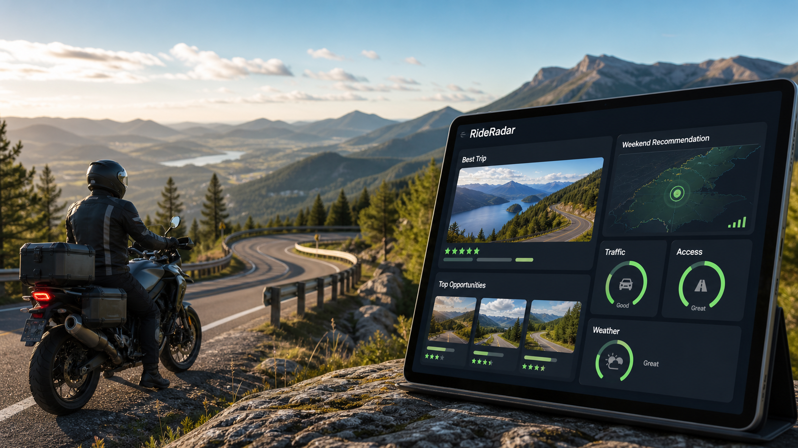
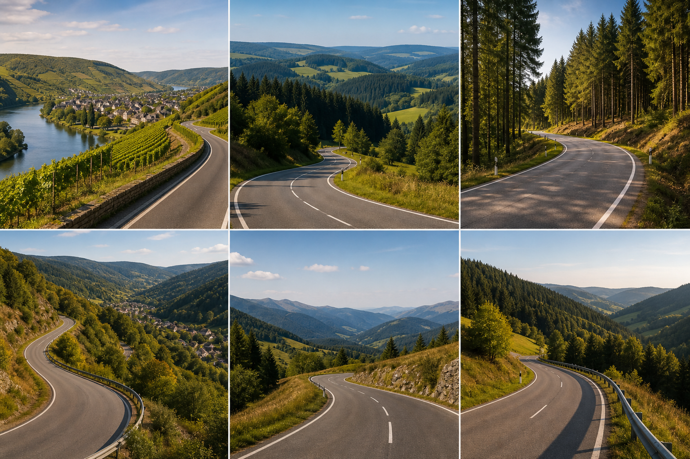

# RideRadar

RideRadar automatically analyzes weather, forecast stability, trip duration, route distance, holidays, restriction risk, and riding opportunities to recommend the best motorcycle destinations within reach.

Stop checking ten different websites. Know where to ride before you leave the garage.





## Why RideRadar?

Normally riders check Buienradar, Windy, Google Maps, ANWB, Google Traffic, holiday calendars, motorcycle forums, and local closure notices before deciding where to ride.

RideRadar combines those signals into one Home Assistant recommendation:

- where to ride
- when to ride
- why that destination is recommended
- whether traffic or holidays will hurt the ride
- whether motorcycle restrictions may affect the route
- whether the destination is worth the travel distance

## Ride Quality, Not Weather Alone

Motorcyclists do not care about weather in isolation. Perfect weather can still mean a poor ride if roads are full of holiday traffic, caravans, tourists, roadworks, or motorcycle restrictions.

RideRadar exposes a rider-facing `ride_quality_score` built from:

| Signal | Purpose |
| --- | --- |
| Weather score | Dry, calm, comfortable riding conditions |
| Stability score | Consistency across the complete trip |
| Temperature score | Comfortable temperatures for riding gear |
| Distance score | Whether the destination is worth the travel distance |
| Holiday pressure score | Public holiday, school holiday, and long-weekend impact |
| Access score | Motorcycle restriction and closure risk |
| Road fun score | Destination suitability for enjoyable motorcycle roads |

Current holiday, access, traffic pressure, tourism pressure, and road-fun scoring is deterministic and offline-friendly. It uses destination profiles, public-holiday calculations, long-weekend detection, seasonality, and known regional motorcycle restriction risk. Future routing providers can replace these heuristics with live traffic and road closure data.

## 10-Step Quickstart

1. Install RideRadar through HACS as a custom repository.
2. Restart Home Assistant.
3. Go to Settings > Devices & services > Add integration.
4. Configure your start location by searching for a place or address, for example `Hardenberg, Nederland`.
5. Choose your trip duration, such as 1 day, 2 days, 3 days, or custom.
6. Choose the forecast horizon days RideRadar should evaluate.
7. Configure your maximum route distance.
8. Choose the destination areas RideRadar should compare.
9. Add one of the dashboard cards below.
10. Check RideRadar before planning the ride.

## Ready-To-Copy Dashboard Examples

### Best Trip

```yaml
type: markdown
title: RideRadar best trip
content: >
  ## {{ states('sensor.rideradar_best_trip_destination') }}

  Ride quality: **{{ states('sensor.rideradar_best_ride_quality_score') }}/100**

  Starts: **{{ states('sensor.rideradar_best_trip_start_day') }}**

  Duration: **{{ states('sensor.rideradar_trip_duration') }} days**

  {{ states('sensor.rideradar_best_summary') }}
```

### Top 5 Reachable Destinations

```yaml
type: markdown
title: RideRadar ranking
content: >
  
  | Destination | Score | Distance | Traffic | Access |
  | --- | ---: | ---: | --- | --- |
  
  | {{ item.destination }} | {{ item.ride_quality_score }} | {{ item.route_distance_km | round(0) }} km | {{ item.traffic_level }} | {{ item.access_status }} |
  
```

### Top 5 Availability Windows

```yaml
type: markdown
title: RideRadar availability
content: >
  
  
  - **{{ item.destination }}** from {{ item.start_date }} to {{ item.end_date }}:
    {{ item.ride_quality_score }}/100, {{ item.verdict }}
  
```

### Best Weekend Opportunity

```yaml
type: markdown
title: Best weekend ride
content: >
  
  
  **{{ item.destination }}** from {{ item.start_date }} to {{ item.end_date }}

  Ride quality: **{{ item.ride_quality_score }}/100**

  {{ item.explanation }}
  
  No weekend opportunity is available in the current forecast horizon.
  
```

### Should I Ride Now Or Wait?

```yaml
type: markdown
title: Best future window
content: >
  
  
  Sauerland best upcoming score:
  **{{ states('sensor.rideradar_sauerland_best_future_window') }}/100**

  Starts in:
  **{{ state_attr('sensor.rideradar_sauerland_best_future_window', 'days_until') }} days**

  {{ state_attr('sensor.rideradar_sauerland_best_future_window', 'explanation') }}
```

### Destination Detail: Why This Score?

```yaml
type: markdown
title: Sauerland detail
content: >
  
  Ride quality: **{{ state_attr(e, 'ride_quality_score') }}/100**

  Traffic: **{{ state_attr(e, 'ride_experience').traffic_score }}/100**

  Access: **{{ state_attr(e, 'ride_experience').access_score }}/100**

  Stability: **{{ state_attr(e, 'weather_stability_score') }}/100**

  {{ state_attr(e, 'trip_explanation') }}

  Daily scores:
  {{ state_attr(e, 'daily_scores') }}
```

## Availability Windows

RideRadar evaluates every complete trip window inside the forecast horizon.

Example with a 2-day trip duration and 7-day forecast horizon:

- Monday-Tuesday
- Tuesday-Wednesday
- Wednesday-Thursday
- Thursday-Friday
- Friday-Saturday
- Saturday-Sunday

Each window includes destination, start date, end date, duration, ride quality score, weather score, stability score, traffic score, tourism pressure score, holiday score, motorcycle access score, route distance, travel time, daily scores, verdict, and explanation.

Summary sensors:

- `sensor.rideradar_best_opportunities`
- `sensor.rideradar_best_weekend_opportunity`
- `sensor.rideradar_best_weekday_opportunity`
- `sensor.rideradar_best_next_available_opportunity`
- `sensor.rideradar_best_ride_quality_score`

Destination sensors expose:

- `all_trip_windows`
- `best_trip_window`
- `next_good_window`
- `weekend_windows`
- `weekday_windows`
- `ride_quality_score`
- `ride_experience`
- `best_future_window`
- `daily_scores`
- `trip_score_breakdown`
- `trip_explanation`

Example opportunity attribute:

```yaml
destination: Sauerland
start_date: "2026-05-14"
end_date: "2026-05-15"
ride_quality_score: 78
weather_score: 95
traffic_score: 62
traffic_level: "Medium"
tourism_pressure_score: 58
tourism_level: "High"
holiday_pressure_score: 55
motorcycle_access_score: 86
access_score: 86
access_status: "Open"
route_distance_km: 190
verdict: "Good window"
explanation: "Excellent weather, but Ascension Day creates long-weekend traffic pressure."
```

Each destination also gets a best-future-window sensor:

- `sensor.rideradar_sauerland_best_future_window`
- `sensor.rideradar_harz_best_future_window`
- `sensor.rideradar_eifel_best_future_window`

Attributes include `score`, `start_date`, `end_date`, `duration_days`, `days_until`, and `explanation`.

## Destination Imagery

RideRadar bundles local showcase imagery for the README so the project remains offline-friendly:

- `docs/images/rideradar-dashboard-hero.png`
- `docs/images/rideradar-destination-collage.png`
- `docs/images/destinations/mosel-vineyards.png`
- `docs/images/destinations/sauerland-roads.png`
- `docs/images/destinations/harz-forests.png`
- `docs/images/destinations/ardennes-valleys.png`
- `docs/images/destinations/vosges-roads.png`
- `docs/images/destinations/black-forest-roads.png`

The destination collage represents the type of riding environments RideRadar is built for: Mosel vineyards, Sauerland hills, Harz forests, Ardennes valleys, Vosges roads, and Black Forest curves.

## Configuration Guide

Initial setup uses a Home Assistant-native location flow:

1. Enter a readable place or address, for example `Hardenberg, Nederland`, `Rheezerveen, Nederland`, or `Utrecht, Nederland`.
2. RideRadar geocodes it using Open-Meteo.
3. If one result is found, RideRadar shows a confirmation screen.
4. If multiple results are found, choose from readable candidate locations.
5. Confirm the resolved display name and coordinates.

The options flow shows one normal settings screen with:

- current configured start location
- current resolved coordinates
- editable start address/place
- maximum route distance
- trip duration
- forecast horizon days
- activity profile
- enabled destinations

Coordinates are internal resolved data. They are shown for confirmation, not as the primary input method. Raw destination JSON is not part of the normal setup or options experience; import/export remains an advanced maintenance path only.

## Troubleshooting

- Start location not found: try a nearby town, a larger city, or add the country name.
- Wrong location found: choose a different candidate or search with more context.
- No best destination: enable at least one destination or increase maximum route distance.
- No weekend opportunity: increase the forecast horizon or wait for more forecast data.
- Distances look approximate: RideRadar currently uses a fallback route estimate with a configurable detour factor.
- Missing destination sensor after editing destinations: reload the integration or remove stale disabled entities from Settings > Devices & services > Entities.

## Development

Create a virtual environment and install development dependencies:

```bash
python -m venv .venv
source .venv/bin/activate
python -m pip install -e ".[dev]"
```

Run tests:

```bash
PYTHONPATH=. pytest
```

Run Ruff:

```bash
ruff check .
```

Run hassfest if installed:

```bash
hassfest
```

## Roadmap

- Add OSRM routing provider support.
- Add GraphHopper and OpenRouteService provider adapters.
- Add richer activity profiles for camping, hiking, and longer touring.
- Add calendar-aware availability.
- Add repairs when all destinations are disabled or unreachable.
- Add screenshots for setup, options, and dashboard examples.
